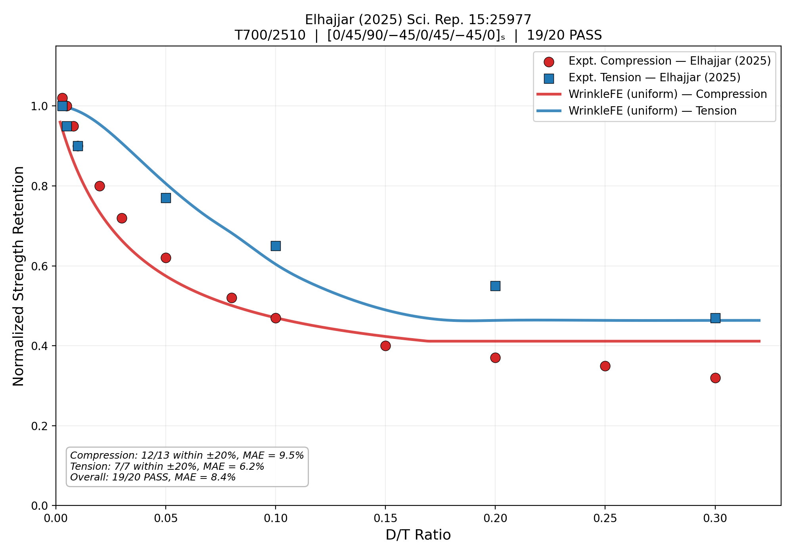

# WrinkleFE

An open-source Python finite element package for predicting strength and stiffness knockdown in composite laminates containing fiber waviness defects.



## Features

- **Compression model:** CLT-weighted Budiansky-Fleck kink-band with layup-dependent confinement
- **Tension model:** Three-mechanism (fiber cos^2 theta, Hashin matrix, curved-beam sigma_33 delamination) with thick-ply in-situ correction
- **3D finite element:** Structured hexahedral mesh with LaRC04/05 failure criteria
- **Five morphologies:** Stack, convex, concave, uniform, graded (with configurable decay floor)
- **Graded averaging:** Through-thickness ply-averaged knockdown for graded wrinkles
- **PyQt6 GUI:** Interactive analysis with real-time stress visualization
- **4 built-in materials:** AS4/3501-6, IM7/8552, T300/914, T700/2510
- **414 tests** covering all modules

## Installation

### From source (recommended)

```bash
git clone https://github.com/elhajjar1/WrinkleFE.git
cd WrinkleFE
pip install -e ".[all]"
```

### Dependencies only

```bash
pip install numpy scipy matplotlib PyQt6 pyvista pyvistaqt
```

### Verify installation

```bash
python -c "import wrinklefe; print('WrinkleFE installed successfully')"
```

### Run tests

```bash
pytest
```

## Quick Start

### GUI

```bash
wrinklefe-gui
```

### Command line

```bash
wrinklefe --help
```

### Python API

```python
from wrinklefe.analysis import AnalysisConfig, WrinkleAnalysis

config = AnalysisConfig(
    amplitude=0.366, wavelength=16.0, width=12.0,
    morphology="stack", loading="compression",
)
result = WrinkleAnalysis(config).run()
print(result.summary())
```

### Tension analysis

```python
config = AnalysisConfig(
    amplitude=0.366, wavelength=16.0, width=12.0,
    morphology="stack", loading="tension",
    angles=[0, 45, 90, -45, 0, 45, -45, 0, 0, -45, 45, 0, -45, 90, 45, 0],
    ply_thickness=0.152,
)
result = WrinkleAnalysis(config).run()
print(result.summary())
```

### Graded morphology (embedded wrinkle)

```python
config = AnalysisConfig(
    amplitude=0.5, wavelength=15.0, width=11.0,
    morphology="graded", decay_floor=0.0,
    loading="compression",
)
result = WrinkleAnalysis(config).run()
print(result.analytical_knockdown)
```

## Validation

Validated against 26 experimental data points from two independent datasets:

| Dataset | Loading | Cases | Pass | MAE |
|---------|---------|-------|------|-----|
| Elhajjar (2025) | Compression | 13 | 12/13 | 9.5% |
| Elhajjar (2025) | Tension | 7 | 7/7 | 6.2% |
| Mukhopadhyay (2015) | Compression | 3 | 2/3 | 17.3% |
| Mukhopadhyay (2015) | Tension | 3 | 3/3 | 12.6% |
| **Total** | | **26** | **24/26** | **9.9%** |

## How It Works

### Compression

CLT-weighted Budiansky-Fleck:

```
KD_lam = f_0 / (1 + theta / gamma_Y_eff) + (1 - f_0)
gamma_Y_eff = 0.020 + 0.050 * f_confined
```

### Tension

Three-mechanism minimum, CLT-weighted:

```
KD_lam = f_0 * min(cos^2(theta), KD_matrix, KD_oop) + (1 - f_0)
```

For graded morphology, knockdowns are averaged over all 0-degree plies at their local through-thickness angles.

## References

- Elhajjar, R. (2025). Scientific Reports, 15:25977.
- Mukhopadhyay, S. et al. (2015). Composites Part A, 73:132-142; 77:219-228.
- Budiansky, B. & Fleck, N.A. (1993). J. Mech. Phys. Solids, 41(1), 183-211.
- Pinho, S.T. et al. (2005). NASA-TM-2005-213530.
- Camanho, P.P. et al. (2006). Composites Part A, 37(2), 165-176.
- Jin, L. et al. (2026). Thin-Walled Structures, 219:114237.

## License

MIT - see [LICENSE](LICENSE)

## Contributing

See [CONTRIBUTING.md](CONTRIBUTING.md)

## Citation

If you use WrinkleFE in your research, please cite:

```bibtex
@software{elhajjar2025wrinklefe,
  author = {Elhajjar, Rani},
  title = {WrinkleFE: Finite Element Package for Wrinkled Composite Laminates},
  year = {2025},
  url = {https://github.com/elhajjar1/WrinkleFE}
}
```
