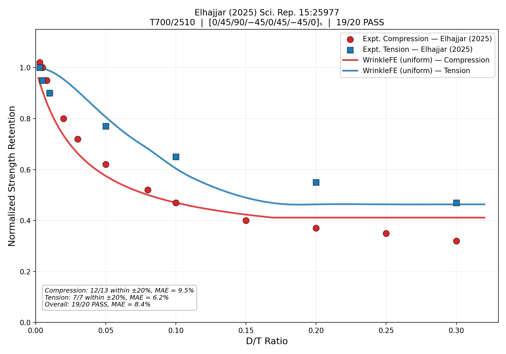
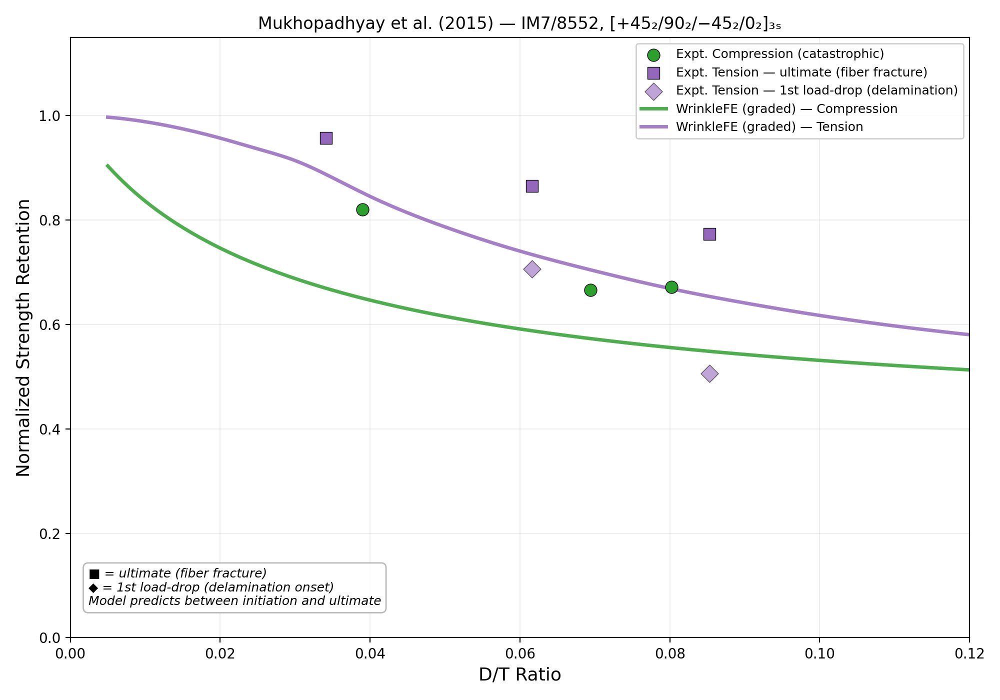

# Summary

WrinkleFE is a Python finite element package for predicting strength and stiffness knockdown in composite laminates containing fiber waviness defects. The software combines Budiansky--Fleck kink-band theory [@BudianskyFleck1993], Gaussian-sinusoidal wrinkle geometry [@Jin2026], the NASA LaRC04/05 failure criteria [@Pinho2005; @DavilaCamanho2005], and a three-mechanism tension knockdown model based on stress transformation and curved-beam interlaminar mechanics [@Timoshenko1959]. Five wrinkle morphologies are supported---stack, convex, concave, uniform, and graded---covering the defect configurations encountered in practice [@EllHajjar2023]. A PyQt6 graphical interface enables interactive analysis with real-time visualization.

# Statement of Need

Fiber waviness is the most common manufacturing defect in composite structures, arising from ply consolidation, tool--part interaction, automated fiber placement, and co-bonding [@Wisnom1990; @EllHajjar2023]. Even small fiber misalignment angles of 5--10 degrees can reduce compression strength by 30--60% through kink-band formation [@Hsiao1996]. Tension strength is also significantly degraded---23--53% reduction at moderate-to-severe waviness---through interlaminar stress concentration and progressive delamination [@Elhajjar2025; @Mukhopadhyay2015], contradicting the common assumption that tension knockdown is negligible.

No open-source software currently integrates wrinkle geometry parameterization, physics-based failure criteria, and finite element stress analysis in a single framework. WrinkleFE addresses this gap with validated analytical and FE models for both compression and tension loading.

# Software Design

WrinkleFE provides two complementary prediction approaches:

**Compression:** A CLT-weighted Budiansky--Fleck model, $\text{KD} = f_0/(1+\theta/\gamma_Y^{eff}) + (1-f_0)$, where $\gamma_Y^{eff} = 0.020 + 0.050 f_{\text{confined}}$ captures ply confinement from the layup stacking sequence [@Fleck1997; @Pimenta2015].

**Tension:** A three-mechanism model taking the minimum of fiber tension ($\cos^2\theta$), matrix tension (Hashin interaction with thick-ply in-situ strengths [@Camanho2006]), and curved-beam delamination ($\sigma_{33} = X_T h_{\text{eff}} \kappa_{\max}$). For graded morphology, knockdowns are averaged over all 0-degree plies at their local through-thickness angles.

Both models use CLT weighting: $\text{KD}_{\text{lam}} = f_0 \cdot \text{KD}_{0^\circ} + (1-f_0)$, separating ply confinement from load redistribution. The 3D FE pipeline uses 8-node hexahedral elements with LaRC04/05 failure evaluation [@Pinho2005] at every Gauss point, providing damage initiation predictions that complement the analytical ultimate-failure estimates.

# Validation

WrinkleFE has been validated against 26 experimental data points from two independent datasets (\autoref{fig:validation}): @Elhajjar2025 (T700/2510, uniform waviness, 19/20 PASS, MAE = 8.4%) and @Mukhopadhyay2015 (IM7/8552, graded waviness, 5/6 PASS, MAE = 15.0%). Overall: 24/26 PASS within $\pm$20% tolerance (MAE = 9.9%). The wavelength model $\lambda = 19.9A$ is calibrated from micrograph geometry [@Elhajjar2014].

# AI Usage Disclosure

Anthropic's Claude Code assisted with code generation, testing, and documentation. All scientific methodology was directed by the author based on established composite mechanics theory.

# Acknowledgments

The author thanks the developers of NumPy, SciPy, matplotlib, and PyQt6.

# References
